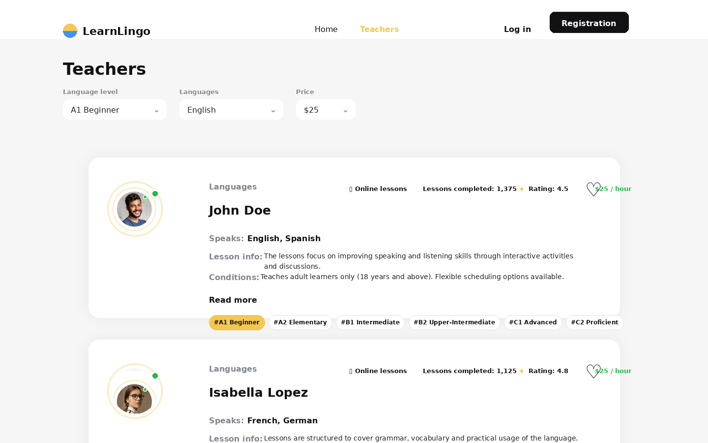
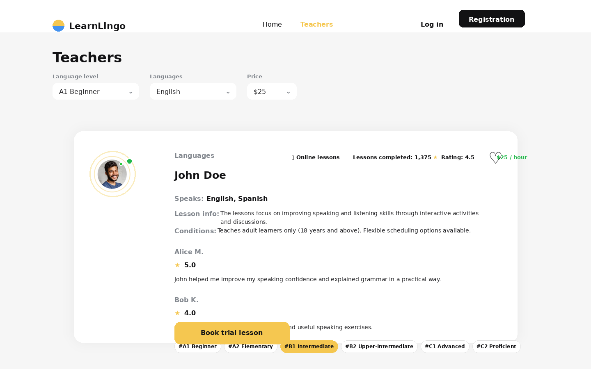
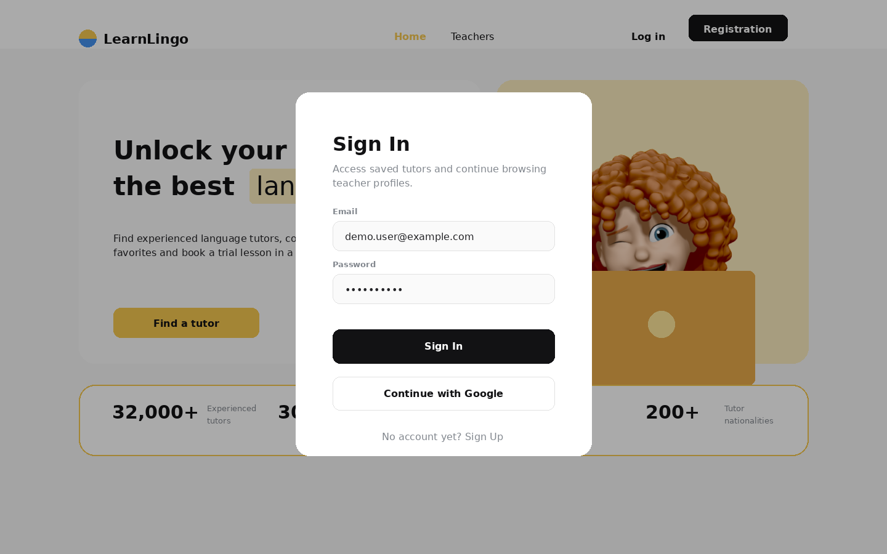
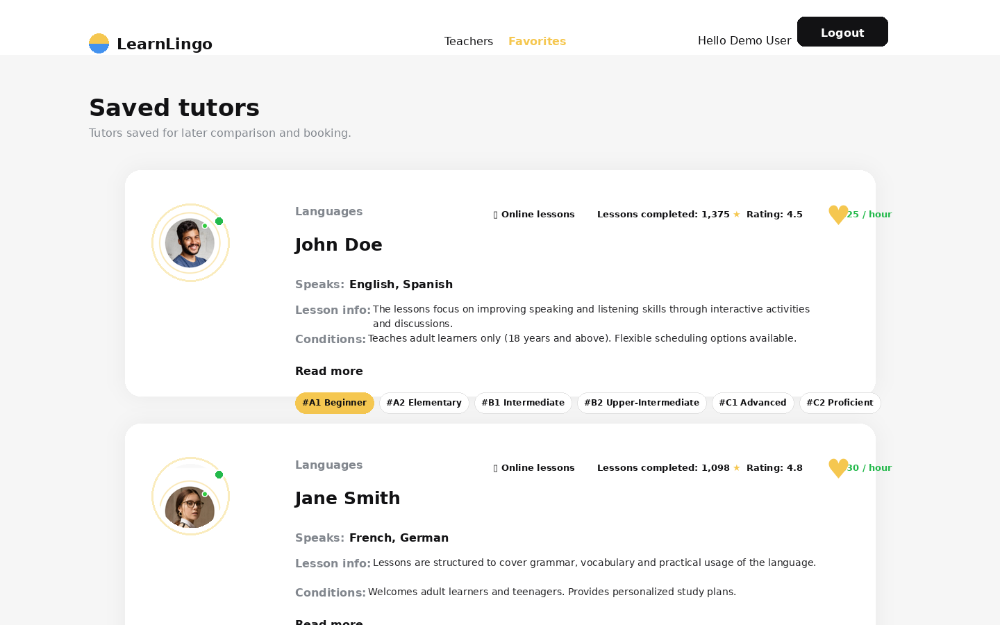
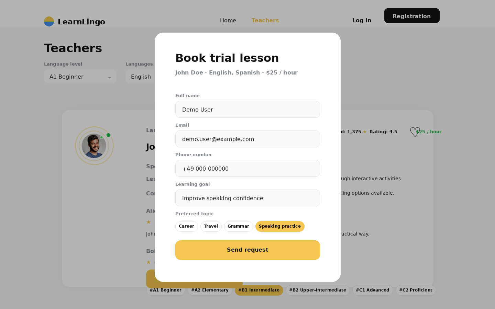

# LearnLingo — Language Teacher Marketplace MVP

LearnLingo is a React-based language learning marketplace prototype where users can browse online language teachers, filter them by language, level and hourly price, authenticate with Firebase, save favorite teachers and request a trial lesson.

The project demonstrates a realistic client-facing frontend application built with React, Redux Toolkit, React Router, Formik/Yup validation and Firebase Authentication / Realtime Database. It is suitable as a portfolio project for frontend roles, freelance landing-page-to-MVP work, and Firebase-backed product prototypes.

## Features

- Public landing page with product positioning and key platform statistics
- Teacher catalogue with reusable teacher cards
- Filtering by language, student level and price
- Incremental “Load more” pagination pattern
- Firebase email/password authentication
- Google sign-in through Firebase Authentication
- Protected Favorites page for authenticated users
- Add/remove favorite teachers with Firebase Realtime Database persistence
- Trial lesson modal with validated form fields
- Form validation with Formik and Yup
- Route protection for authenticated-only pages
- Redux Toolkit state management for auth, teachers and favorites
- GitHub Pages deployment workflow with GitHub Actions
- Environment-based Firebase configuration for sensitive client keys

## Tech Stack

### Frontend

- React 18
- React Router DOM
- Redux Toolkit
- React Redux
- Redux Persist
- CSS Modules
- React Select
- React Loader Spinner

### Forms and Validation

- Formik
- Yup

### Backend-as-a-Service

- Firebase Authentication
- Firebase Google Authentication
- Firebase Realtime Database

### Tooling and Deployment

- Create React App
- ESLint through react-scripts
- Prettier configuration
- GitHub Actions
- GitHub Pages

## Architecture Overview

The application is structured as a client-side React SPA with Firebase used as the backend service layer.

```text
User Interface
  └── React pages and reusable components
        ├── Home page
        ├── Teachers catalogue
        ├── Favorites page
        └── Auth / trial lesson modals

State Management
  └── Redux Toolkit slices
        ├── auth
        ├── teachers
        └── favorites

Data Layer
  └── Firebase SDK
        ├── Firebase Authentication
        ├── Google sign-in provider
        └── Realtime Database

Deployment
  └── GitHub Actions
        └── Build and deploy to GitHub Pages
```

The frontend does not use a custom REST API. Data is fetched directly from Firebase Realtime Database, while authentication is handled through Firebase Auth. This is a valid architecture for a lightweight MVP, prototype or small client-facing application, but it should be described honestly as a Firebase-backed SPA rather than a traditional fullstack application.

## Screenshots

Add screenshots to an `assets/screenshots/` folder and reference them here.

Recommended screenshots:

```md







```

## Installation

Clone the repository:

```bash
git clone https://github.com/turboboyd/LearnLingo.git
cd LearnLingo
```

Install dependencies:

```bash
npm install
```

## Environment Setup

Create a `.env` file in the project root:

```env
REACT_APP_FIREBASE_API_KEY=your_firebase_api_key
REACT_APP_FIREBASE_AUTH_DOMAIN=your_project.firebaseapp.com
REACT_APP_FIREBASE_PROJECT_ID=your_project_id
REACT_APP_FIREBASE_STORAGE_BUCKET=your_project.appspot.com
REACT_APP_FIREBASE_MESSAGING_SENDER_ID=your_sender_id
REACT_APP_FIREBASE_APP_ID=your_firebase_app_id
```

The Firebase Realtime Database URL is currently defined in `src/server/firebaseConfig.js`. For a cleaner production setup, move it to an environment variable as well:

```env
REACT_APP_FIREBASE_DATABASE_URL=your_database_url
```

## Running Locally

Start the development server:

```bash
npm start
```

Run linting:

```bash
npm run lint:js
```

Create a production build:

```bash
npm run build
```

## API / Backend Description

This project uses Firebase as Backend-as-a-Service instead of a custom backend server.

### Authentication

Authentication is handled with Firebase Authentication:

- email/password registration
- email/password login
- Google sign-in
- logout
- auth state restoration on application load

### Database

Firebase Realtime Database is used for:

- loading teacher records from `teachers/`
- storing user-specific favorites under `favorites/{userId}`

Example logical data model:

```text
teachers/
  teacherId/
    name
    surname
    languages[]
    levels[]
    rating
    reviews[]
    price_per_hour
    lessons_done
    lesson_info
    conditions[]

favorites/
  userId/
    teacherId/
      teacher data snapshot
```

For a larger production system, favorites should ideally store references to teacher IDs rather than full teacher object snapshots. A custom backend could also be added later for booking workflows, payments, audit logs and admin moderation.

## Folder Structure

```text
src/
  components/          Reusable UI components and feature components
  hooks/               Custom hooks for auth, teachers, favorites, filtering and pagination
  images/              Static icons, SVGs and visual assets
  pages/               Route-level pages: Home, Teachers, Favorites
  redux/               Redux Toolkit slices, async thunks, selectors and reducers
  server/              Firebase configuration and exported Firebase services
  utils/               Shared constants and visual configuration
  index.js             React application entry point
  index.css            Global styles
  variables.css        CSS variables
```

Important folders:

- `components/TeacherCard/` contains the teacher card composition: avatar, stats, information, levels, favorite button and trial lesson CTA.
- `components/Form/` contains authentication and trial lesson forms with validation.
- `redux/auth/` manages Firebase authentication state.
- `redux/teacher/` manages teacher catalogue loading.
- `redux/favorite/` manages favorite teachers.
- `hooks/` separates reusable UI/data logic from components.

## Business Use Case

LearnLingo represents a marketplace-style MVP for language learning platforms. A similar product could be used by:

- online language schools
- private teacher networks
- tutoring agencies
- education startups validating a marketplace idea
- small businesses that need a fast Firebase-based MVP before investing in a custom backend

The project demonstrates the core user journey of an education marketplace:

1. User visits landing page.
2. User browses teachers.
3. User filters by learning needs.
4. User checks teacher details and reviews.
5. User signs in.
6. User saves favorites.
7. User requests a trial lesson.

## Why This Project Is Technically Interesting

This project is useful for a portfolio because it is more than a static landing page. It includes:

- real client-side routing
- route protection
- Firebase authentication
- third-party OAuth sign-in
- database reads and writes
- global state management with Redux Toolkit
- reusable custom hooks
- validated forms
- modal workflows
- catalogue filtering
- persisted user-specific data
- deployment automation through GitHub Actions

These are practical skills frequently needed in freelance MVPs, startup prototypes and junior+/middle frontend work.

## Production-Oriented Notes

Current production-oriented elements:

- Firebase config values are read from environment variables
- GitHub Actions workflow builds and deploys the app
- Protected route is used for authenticated-only content
- Form validation is handled through schemas
- Business logic is partly extracted into hooks and Redux async thunks

Recommended improvements before presenting this as a stronger production project:

- Move `databaseURL` to environment variables
- Add `.env.example`
- Add proper loading and empty states for teachers and favorites
- Fix cases where `snapshot.val()` can be `null`
- Add error UI for failed Firebase requests
- Store favorite teacher IDs instead of duplicating full teacher objects
- Add TypeScript or at least stricter PropTypes coverage
- Add unit tests for hooks, reducers and form validation
- Add Firebase security rules documentation
- Improve accessibility of modals and form controls
- Add screenshots and a live demo link at the top of the README
- Replace older GitHub Actions versions with current maintained versions

## Future Improvements

- Teacher booking persistence in Firebase
- Admin panel for managing teachers
- Teacher profile detail page
- Search by teacher name or keyword
- Sorting by rating, price and popularity
- Calendar-based lesson booking
- Email notifications for trial lesson requests
- Payment integration prototype
- User profile settings
- Internationalization support
- TypeScript migration
- Test coverage with React Testing Library
- Firebase security rules and emulator setup
- CI pipeline with lint, tests and build verification

## Repository Status

This repository is best presented as a frontend marketplace MVP built with React and Firebase. It should not be marketed as a completed production marketplace with payments, admin tools or real booking operations unless those features are added.
